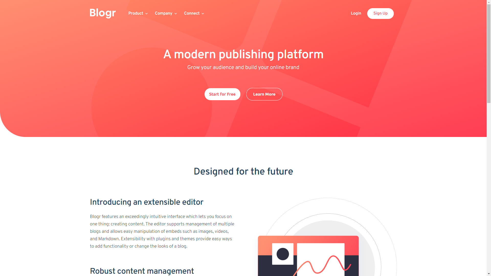

# Frontend Mentor - Blogr landing page solution

This is a solution to the [Blogr landing page challenge on Frontend Mentor](https://www.frontendmentor.io/challenges/blogr-landing-page-EX2RLAApP). 

## Table of contents

- [Overview](#overview)
  - [The challenge](#the-challenge)
  - [Screenshot](#screenshot)
  - [Links](#links)
- [My process](#my-process)
  - [Built with](#built-with)
  - [What I learned](#what-i-learned)
  - [Continued development](#continued-development)
  - [Useful resources](#useful-resources)

## Overview

### The challenge

Your task is to build out the project to the designs inside the `/design` folder. You will find both a mobile and a desktop version of the design. 

The designs are in JPG static format. Using JPGs will mean that you'll need to use your best judgment for styles such as `font-size`, `padding` and `margin`.

Users should be able to:

- View the optimal layout for the site depending on their device's screen size
- See hover states for all interactive elements on the page

### Screenshot

I've included 4 screenshots in the `/screenshots` folder: mobile, tablet, desktop, and fullscreen.

### Links

I'll update these links once I submit my solution. 

- [Solution URL](https://www.frontendmentor.io/solutions/responsive-landing-page-using-css-grid-flexbox-and-bem-UssRPhkLN#comment-61701a127f0dd1434ed59940)
- [Live Site URL](https://victor-nyagudi.github.io/blogr-landing-page/)

## My process

### Built with

- Semantic HTML5 markup
- CSS custom properties
- Flexbox
- CSS Grid
- Mobile-first workflow
- Vanilla JS

### What I learned

I learned to be patient. 

This challenge has been the most time consuming of them all, mostly becuase I couldn't figure out how to position the images properly. 

Most of the stuff here are things I've been working on, so this provided an opportunity to practice
more than anything.

However, I did learn how to implement a list that shows up when you click on one of the navigation
options, and overall, how to make a landing page. 

It's a lot more challenging than I expected and involved way more lines of code, but I'm glad I
got the reps in and look forward to working on such projects in future to get better at them.

### Continued development

I lost track of time on this one because of how it frustrated me. I've also been feeling kind of
burned out lately with migraines throughout the day, but either way, I feel good now that it's done.

It's not my best work because I feel like I used absolute positioning more than I needed, but this 
is mostly because the usual methods didn't get me where I wanted. 

I'm submitting this solution the way it is so that I can get some feedback on how to position things
better then hopefully, implement those changes later on as corrections. 

### Useful resources

Most of the knowledge required for this I had some grasp on or required a little bit of reading, but
nothing too serious, so no reason to add any links here. 